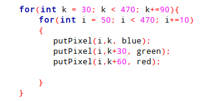

Introdução

	O presente projeto tinha como finalidade introduzir aos alunos da disciplina uma noção de programação voltada para a Computação Gráfica. Promovendo a rasterização de pontos, linhas e triângulos, por meio de algoritmos como o de Bresenham, utilizando bibliotecas gráficas da linguagem C, como o OpenGL.

Desenvolvimento

	O projeto foi dividido em três partes. Cada uma delas consistia em desenvolver uma função para cada tipo de rasterização.
A primeira função, foi chamada de putPixel, que tinha como propósito desenhar pixels na janela de exibição a partir de parâmetros informados pelo programador, dada a posição do pixel em x e y, e as suas cores RGBA (No algoritmo, foi-se utilizado um array de inteiros para guardar o valor de cada cor do pixel).

	Já que os pixels são formados por 4 bytes que representam as cores, o método usado para percorrer todo o Buffer foi, dada a posição de X, multiplicada pela quantidade de bytes que podem ser armazenados em cada pixel, somado à cada posição do array das cores passadas como parâmetro (Nesse caso em particular, o algoritmo percorre o Color Buffer em X. Para fazê-lo percorrer em Y, aplica-se o mesmo sistema, exceto somar com a posição de cada cor do array informado. 

                        

E por fim, a função DrawTriangle, que pedia para desenhar triângulos na janela. Em comparação com as outras funções, essa foi a mais simples de ser implementada, já que, após resolver o problema dos quadrantes na função DrawLine, nos permitiu a rasterização de linhas em qualquer direção, então, para desenhar os triângulos só seriam necessárias três linhas de vértices semelhantes. 

Conclusão

	O projeto nos fez raciocinar um pouco sobre como funciona a programação gráfica. Algo que de certa forma é complexo porém bastante poderoso. A minuciosidade de trabalhar com cada pixel na tela, com cada byte por pixel, só nos faz perceber o quão incrível é a área. Tendo em vista isso, já era de se esperar que houvessem bugs em alguns casos propostos, principalmente na parte da interpolação das cores nas linhas (Só reiterando, a parte mais complexa).
